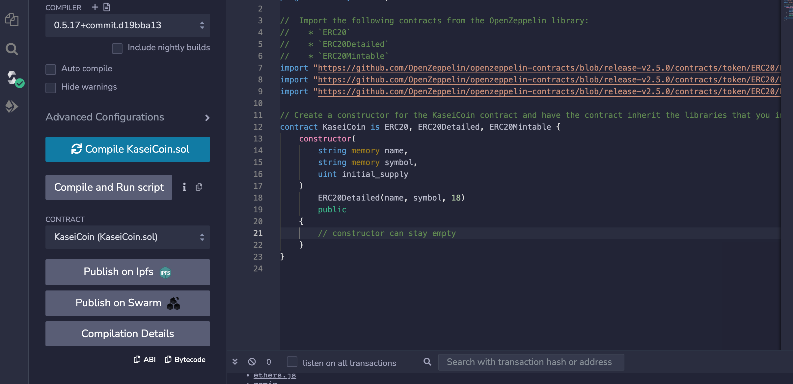
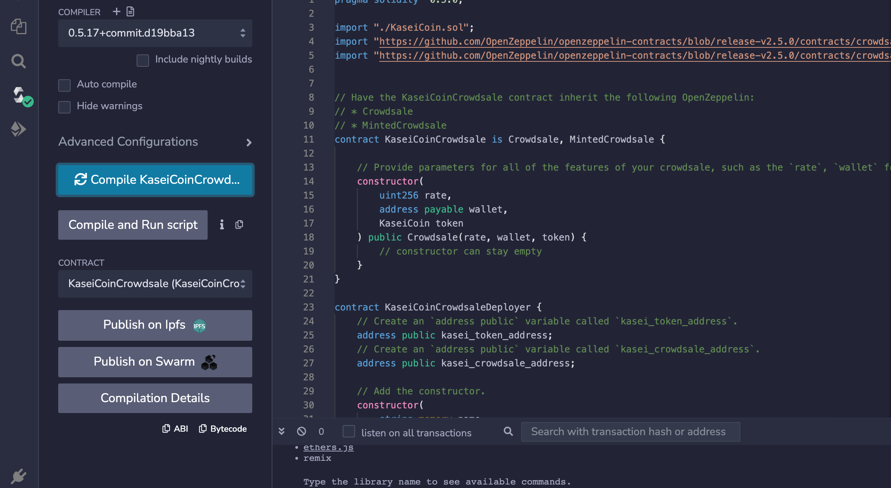
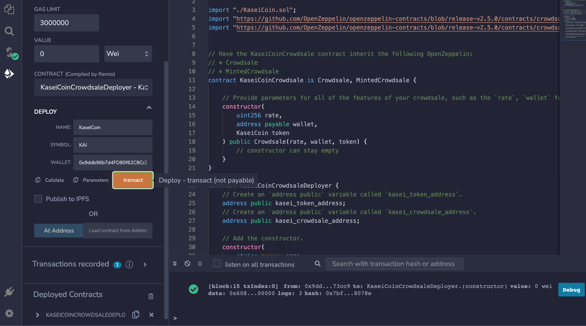
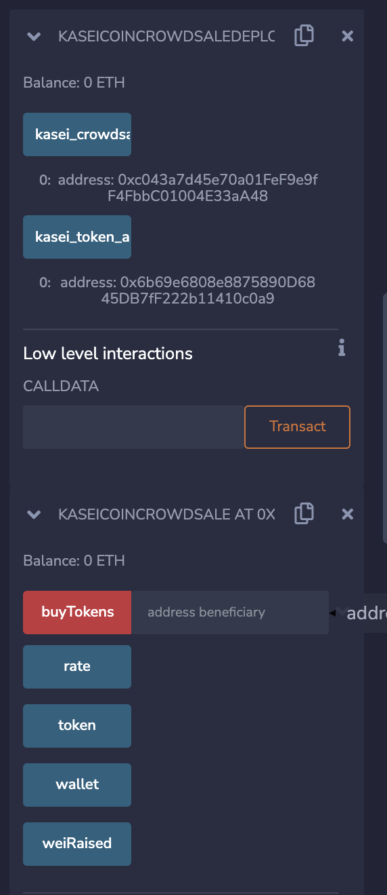
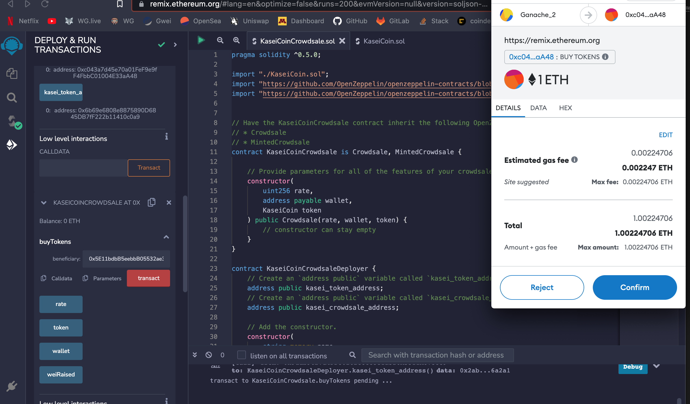
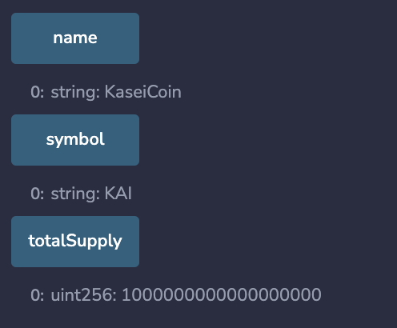
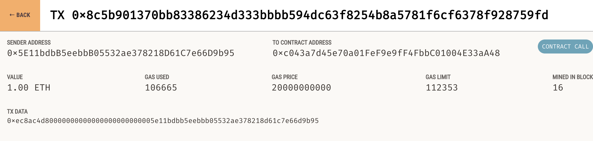
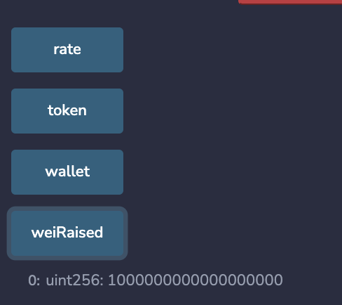

# crowdSale

- ERC-20 crowdsale contract using OpenZeppelin Solidity library
- Tested using Ganache and Metamask

# Compliled contracts:
## KaseiCoin contract:

## Crowdsale contract:

---
# Deployed contracts:
## Crowdsale:

## KaseiCoin:

---
# Testing contracts:
## 1 ETH buy:

## totalSupply:

## Ganache tranaction:

## weiRaised:
